# LearnCloud Database Schema V1 - Revenue-Ready Core
**HQ:** Bulawayo, ZW | **Version:** 1.0 | **Date:** 2026-08-02 | **DB:** MySQL 8.0 (InnoDB) | **Charset:** utf8mb4_unicode_ci
**Brand Context:** LearnClod / LearnCloud - Colors #0F153A #5F3F96 #307EC0

This document is the schema every later prompt builds on. No application code.

---

## 0. GLOBAL CONVENTIONS (Applies to ALL tables)

**Audit Columns - REQUIRED ON EVERY TABLE:**
- `id` BIGINT UNSIGNED NOT NULL AUTO_INCREMENT PRIMARY KEY
- `created_at` DATETIME NOT NULL DEFAULT CURRENT_TIMESTAMP
- `created_by` BIGINT UNSIGNED NULL (FK -> users.id, NULL for system seed / public admission)
- `updated_at` DATETIME NOT NULL DEFAULT CURRENT_TIMESTAMP ON UPDATE CURRENT_TIMESTAMP
- `updated_by` BIGINT UNSIGNED NULL
- `is_deleted` TINYINT(1) NOT NULL DEFAULT 0
- `deleted_at` DATETIME NULL
- `deleted_by` BIGINT UNSIGNED NULL

**Tenant Isolation:**
- Every tenant-owned table includes `tenant_id` BIGINT UNSIGNED NOT NULL (except `tenants` itself, `subscription_plans`). `users` has `tenant_id NULLABLE` to allow Platform Admin (NULL = platform).
- Every filtering index LEADS with `tenant_id` as first column.
- All FKs that cross tenant-owned tables include tenant_id in unique checks at application layer (MySQL doesn't enforce multi-col FK unless composite, but we document intent).

**Money:**
- All money = `amount DECIMAL(18,2) NOT NULL` + `currency CHAR(3) NOT NULL DEFAULT 'USD'` (ISO 4217: USD, ZWG, ZAR)
- Totals also DECIMAL(18,2). Never FLOAT.

**Academic Data:**
- Any table that is academic carries `academic_year_id BIGINT UNSIGNED NOT NULL` and `term_id BIGINT UNSIGNED NULL` (NULL allowed only where year-wide, e.g., grade definition). If term-specific, both NOT NULL.

**Soft Delete:**
- Queries must add `WHERE is_deleted=0`. Unique constraints are implemented as `WHERE is_deleted=0` logic at app layer; MySQL unique indexes include `is_deleted` trick or we use partial unique via `deleted_at` nullable? For V1 we include `is_deleted` in unique? No, we keep unique on business key + tenant_id and enforce app doesn't reuse soft-deleted numbers. For simplicity, list unique as (tenant_id, business_key, is_deleted) concept but implement as (tenant_id, business_key) where is_deleted=0 in app.

---

## 1. TENANCY, SUBSCRIPTIONS, USERS & RBAC

### Table: `tenants`
Platform root. Not tenant-owned (it IS the tenant).

**Purpose:** Represents one independent school isolated deployment.

Columns:
| Column | Type | Null | Default | Notes |
|---|---|---|---|---|
| id | BIGINT UNSIGNED | NO | AUTO | PK |
| name | VARCHAR(255) | NO | - | e.g., Petra High |
| slug | VARCHAR(100) | NO | - | subdomain slug, e.g., petra |
| status | ENUM('trial','active','suspended','cancelled') | NO | 'trial' | |
| city | VARCHAR(100) | NO | 'Bulawayo' | |
| country | CHAR(2) | NO | 'ZW' | |
| contact_email | VARCHAR(255) | NO | - | |
| contact_phone | VARCHAR(50) | YES | NULL | |
| logo_url | VARCHAR(500) | YES | NULL | |
| primary_color | CHAR(7) | NO | '#0F153A' | from palette |
| learner_count_band | VARCHAR(20) | NO | - | 150-300 etc |
| created_at etc | - | - | - | audit |

PK: id
FK: none (created_by -> users.id nullable)
Unique: slug (UNIQUE index idx_tenants_slug)
Index: status

### Table: `subscription_plans`
Global catalog, no tenant_id.

**Purpose:** Defines SaaS pricing tiers for billing schools.

Columns:
| id | BIGINT UNSIGNED | NO | AUTO | PK |
| code | VARCHAR(50) | NO | - | starter, growth, scale |
| name | VARCHAR(100) | NO | - | Starter 300 |
| max_learners | INT UNSIGNED | NO | - | 300,800,2000 |
| price_monthly | DECIMAL(18,2) | NO | - | e.g. 99.00 |
| price_annual | DECIMAL(18,2) | NO | - | |
| currency | CHAR(3) | NO | 'USD' | |
| features_json | JSON | YES | NULL | feature flags |
| is_active | TINYINT(1) | NO | 1 | |

PK id, Unique code

### Table: `tenant_subscriptions`
**Purpose:** Tracks which plan a tenant is on and billing cycle.

Columns:
| id | BIGINT UNSIGNED | NO | AUTO |
| tenant_id | BIGINT UNSIGNED | NO | FK tenants.id |
| plan_id | BIGINT UNSIGNED | NO | FK subscription_plans.id |
| billing_cycle | ENUM('monthly','annual') | NO | 'monthly' |
| status | ENUM('trialing','active','past_due','cancelled','suspended') | NO | 'trialing' |
| trial_ends_at | DATETIME | YES | NULL |
| current_period_start | DATE | NO | - |
| current_period_end | DATE | NO | - |
| metered_active_students | INT UNSIGNED | NO | 0 DEFAULT |
| over_limit_flag | TINYINT(1) | NO | 0 |
| last_invoiced_at | DATETIME | YES | NULL |
| currency | CHAR(3) | NO | 'USD' | + amount columns inherited if needed |

PK id
FK: tenant_id -> tenants.id ON DELETE CASCADE, plan_id -> plans
Unique: (tenant_id, current_period_start) to prevent duplicates
Indexes:
- INDEX idx_tenant_subs_tenant_status (tenant_id, status)
- INDEX idx_tenant_subs_tenant_period (tenant_id, current_period_end)

### Table: `users`
**Purpose:** Authentication identity for all portals; may belong to a tenant or be platform admin when tenant_id=NULL.

Columns:
| id | BIGINT UNSIGNED | NO | AUTO |
| tenant_id | BIGINT UNSIGNED | YES | NULL FK tenants.id (NULL = platform admin) |
| email | VARCHAR(255) | NO | - |
| phone | VARCHAR(50) | YES | NULL |
| password_hash | VARCHAR(255) | NO | Argon2id |
| display_name | VARCHAR(255) | NO | - |
| status | ENUM('invited','active','disabled') | NO | 'invited' |
| must_change_password | TINYINT(1) | NO | 0 |
| last_login_at | DATETIME | YES | NULL |
| email_verified_at | DATETIME | YES | NULL |

PK id
FK tenant_id -> tenants.id
Unique: (tenant_id, email) -> allows same email across tenants, but for NULL tenant_id we enforce uniqueness at app layer. Also UNIQUE (email, tenant_id) composite.
Indexes:
- INDEX idx_users_tenant_email (tenant_id, email)
- INDEX idx_users_tenant_status (tenant_id, status)
- INDEX idx_users_email_global (email) for platform login

### Table: `roles`
**Purpose:** Reusable role definitions, both system and per-tenant custom.

Columns:
| id | BIGINT UNSIGNED | NO | AUTO |
| tenant_id | BIGINT UNSIGNED | YES | NULL (NULL = system role) |
| code | VARCHAR(50) | NO | e.g. SCHOOL_ADMIN |
| name | VARCHAR(100) | NO | School Admin |
| is_system | TINYINT(1) | NO | 0 |
| description | VARCHAR(255) | YES | NULL |

PK id
Unique: (tenant_id, code)
Indexes: idx_roles_tenant_code (tenant_id, code)

### Table: `permissions`
**Purpose:** Fine-grained permission code list (e.g., fees.invoice.create).

Columns:
| id | BIGINT UNSIGNED | NO | AUTO |
| code | VARCHAR(100) | NO | unique, e.g. attendance.mark |
| name | VARCHAR(150) | NO | |
| module | VARCHAR(50) | NO | e.g. attendance |

PK id, Unique code

### Table: `role_permissions`
**Purpose:** Many-to-many role to permission.

Columns:
| id | BIGINT UNSIGNED | NO | AUTO |
| tenant_id | BIGINT UNSIGNED | NO | FK tenants (denormalized for tenant_id leading index) |
| role_id | BIGINT UNSIGNED | NO | FK roles.id |
| permission_id | BIGINT UNSIGNED | NO | FK permissions.id |

PK id
FKs as above
Unique: (tenant_id, role_id, permission_id)
Index idx_rp_tenant_role (tenant_id, role_id)

### Table: `user_roles`
**Purpose:** Assign roles to users, optionally scoped to academic year.

Columns:
| id | BIGINT UNSIGNED | NO | AUTO |
| tenant_id | BIGINT UNSIGNED | NO | FK |
| user_id | BIGINT UNSIGNED | NO | FK users.id |
| role_id | BIGINT UNSIGNED | NO | FK roles.id |
| academic_year_id | BIGINT UNSIGNED | YES | NULL, for year-scoped roles |

PK id
Unique: (tenant_id, user_id, role_id, academic_year_id)
Indexes: idx_user_roles_tenant_user (tenant_id, user_id)

---

## 2. ACADEMIC STRUCTURE

### Table: `academic_years`
**Purpose:** Defines a school year Jan-Dec with three terms.

Columns:
| id | BIGINT UNSIGNED | NO | AUTO |
| tenant_id | BIGINT UNSIGNED | NO | FK tenants |
| name | VARCHAR(20) | NO | '2026' |
| start_date | DATE | NO | 2026-01-10 |
| end_date | DATE | NO | 2026-12-05 |
| is_current | TINYINT(1) | NO | 0 |
| status | ENUM('draft','active','closed') | NO | 'draft' |

PK id
Unique: (tenant_id, name)
Indexes: idx_ay_tenant_current (tenant_id, is_current) , (tenant_id, status)

### Table: `terms`
**Purpose:** Subdivision of academic year (Term 1-3).

Columns:
| id | BIGINT UNSIGNED | NO | AUTO |
| tenant_id | BIGINT UNSIGNED | NO | |
| academic_year_id | BIGINT UNSIGNED | NO | FK academic_years |
| name | VARCHAR(50) | NO | 'Term 1' |
| term_number | TINYINT UNSIGNED | NO | 1,2,3 |
| start_date | DATE | NO | |
| end_date | DATE | NO | |
| is_current | TINYINT(1) | NO | 0 |

PK id
FK academic_year_id -> academic_years.id
Unique: (tenant_id, academic_year_id, term_number)
Indexes: idx_terms_tenant_year (tenant_id, academic_year_id), (tenant_id, is_current)

### Table: `grades`
**Purpose:** Grade/Form level (Grade 5, Form 2).

Columns:
| id | BIGINT UNSIGNED | NO | |
| tenant_id | BIGINT UNSIGNED | NO | |
| academic_year_id | BIGINT UNSIGNED | NO | to allow grade definitions per year, but reusable; carries year |
| name | VARCHAR(50) | NO | 'Grade 5' |
| code | VARCHAR(20) | NO | 'G5' |
| level_order | INT UNSIGNED | NO | 5 (ordering) |
| is_active | TINYINT(1) | NO | 1 |

PK id
Unique: (tenant_id, academic_year_id, code) AND (tenant_id, academic_year_id, name)
Index idx_grades_tenant_year_order (tenant_id, academic_year_id, level_order)

### Table: `streams`
**Purpose:** Class division within grade (5Blue has capacity, class teacher).

Columns:
| id | BIGINT UNSIGNED | NO | |
| tenant_id | BIGINT UNSIGNED | NO | |
| academic_year_id | BIGINT UNSIGNED | NO | carries academic context |
| term_id | BIGINT UNSIGNED | YES | NULL if stream spans year, else term-specific |
| grade_id | BIGINT UNSIGNED | NO | FK grades |
| name | VARCHAR(50) | NO | 'Blue' |
| full_name | VARCHAR(100) | NO | Generated 'Grade 5 Blue' |
| capacity | INT UNSIGNED | NO | 40 |
| class_teacher_staff_id | BIGINT UNSIGNED | YES | NULL FK staff_profiles.id |
| room_id | BIGINT UNSIGNED | YES | NULL FK rooms.id |

PK id
Unique: (tenant_id, academic_year_id, grade_id, name, is_deleted)
Indexes: idx_streams_tenant_grade_year (tenant_id, grade_id, academic_year_id)

### Table: `rooms`
**Purpose:** Physical teaching spaces for timetable.

Columns:
| id | BIGINT UNSIGNED | NO | |
| tenant_id | BIGINT UNSIGNED | NO | |
| name | VARCHAR(100) | NO | 'Room 5' |
| building | VARCHAR(100) | YES | NULL |
| capacity | INT UNSIGNED | YES | NULL |
| room_type | ENUM('classroom','lab','library','hall','office') | NO | 'classroom' |

PK id, Unique (tenant_id, name)

### Table: `subjects`
**Purpose:** Subject catalog (Math, English).

Columns:
| id | BIGINT UNSIGNED | NO | |
| tenant_id | BIGINT UNSIGNED | NO | |
| name | VARCHAR(100) | NO | 'Mathematics' |
| code | VARCHAR(20) | NO | 'MATH' |
| is_core | TINYINT(1) | NO | 1 |
| department | VARCHAR(100) | YES | NULL |

PK id, Unique (tenant_id, code)

### Table: `grade_subjects`
**Purpose:** Join grade offers subject in a year.

Columns:
| id | BIGINT UNSIGNED | NO | |
| tenant_id | BIGINT UNSIGNED | NO | |
| academic_year_id | BIGINT UNSIGNED | NO | |
| grade_id | BIGINT UNSIGNED | NO | |
| subject_id | BIGINT UNSIGNED | NO | |
| is_compulsory | TINYINT(1) | NO | 1 |

PK id, Unique (tenant_id, academic_year_id, grade_id, subject_id)
Index idx_gs_tenant_year_grade (tenant_id, academic_year_id, grade_id)

---

## 3. STAFF, STUDENTS, GUARDIANS, ENROLMENT HISTORY

### Table: `staff_profiles`
**Purpose:** Staff employment record linked to a user login.

Columns:
| id | BIGINT UNSIGNED | NO | |
| tenant_id | BIGINT UNSIGNED | NO | |
| user_id | BIGINT UNSIGNED | YES | NULL FK users.id (may invite later) |
| staff_number | VARCHAR(50) | NO | ST-0001 auto |
| first_name | VARCHAR(100) | NO | |
| last_name | VARCHAR(100) | NO | |
| employment_type | ENUM('permanent','contract','part_time') | NO | 'permanent' |
| qualification | VARCHAR(255) | YES | NULL |
| national_id | VARCHAR(50) | YES | NULL |
| hire_date | DATE | YES | NULL |
| status | ENUM('active','inactive') | NO | 'active' |

PK id
Unique: (tenant_id, staff_number)
Index idx_staff_tenant_user (tenant_id, user_id)

### Table: `students`
**Purpose:** Immutable identity of a learner; current academic placement derived from enrolments table.

Columns:
| id | BIGINT UNSIGNED | NO | |
| tenant_id | BIGINT UNSIGNED | NO | |
| student_number | VARCHAR(50) | NO | auto per tenant e.g., 2026-0001 |
| first_name | VARCHAR(100) | NO | |
| last_name | VARCHAR(100) | NO | |
| dob | DATE | YES | NULL |
| gender | ENUM('M','F','other') | YES | NULL |
| national_id | VARCHAR(50) | YES | NULL |
| photo_url | VARCHAR(500) | YES | NULL |
| status | ENUM('applicant','active','inactive','alumni','transferred') | NO | 'active' |
| current_enrolment_id | BIGINT UNSIGNED | YES | NULL FK student_enrolments.id (latest) |

PK id
Unique: (tenant_id, student_number)
Unique: (tenant_id, national_id) where national_id NOT NULL -> app enforced
Indexes: idx_students_tenant_status (tenant_id, status), idx_students_tenant_name (tenant_id, last_name, first_name)

### Table: `guardians`
**Purpose:** Parent/guardian person record that may have portal login.

Columns:
| id | BIGINT UNSIGNED | NO | |
| tenant_id | BIGINT UNSIGNED | NO | |
| user_id | BIGINT UNSIGNED | YES | NULL FK users.id for login |
| first_name | VARCHAR(100) | NO | |
| last_name | VARCHAR(100) | NO | |
| phone | VARCHAR(50) | NO | |
| email | VARCHAR(255) | YES | NULL |
| national_id | VARCHAR(50) | YES | NULL |
| address | VARCHAR(500) | YES | NULL |
| occupation | VARCHAR(100) | YES | NULL |

PK id
Unique: (tenant_id, phone) maybe but allow duplicates for shared phone? Index (tenant_id, email)
Indexes: idx_guardians_tenant_phone (tenant_id, phone)

### Table: `guardian_student_links`
**Purpose:** Junction linking guardian to student with relationship and billing flags.

Columns:
| id | BIGINT UNSIGNED | NO | |
| tenant_id | BIGINT UNSIGNED | NO | |
| guardian_id | BIGINT UNSIGNED | NO | FK guardians.id |
| student_id | BIGINT UNSIGNED | NO | FK students.id |
| relationship_type | ENUM('mother','father','guardian','aunt','uncle','grandparent','sibling','other') | NO | |
| is_primary_contact | TINYINT(1) | NO | 0 |
| is_billing_contact | TINYINT(1) | NO | 0 |
| is_emergency_contact | TINYINT(1) | NO | 0 |
| can_pickup | TINYINT(1) | NO | 1 |
| academic_year_id | BIGINT UNSIGNED | NO | carries context |
| term_id | BIGINT UNSIGNED | YES | NULL |

PK id
Unique: (tenant_id, guardian_id, student_id, academic_year_id) to allow re-link per year but prevent duplicate
Indexes:
- idx_gsl_tenant_guardian (tenant_id, guardian_id)
- idx_gsl_tenant_student (tenant_id, student_id)
- idx_gsl_tenant_billing (tenant_id, student_id, is_billing_contact) -> hottest for billing
Check: One is_billing_contact per student per year enforced at app.

### Table: `student_enrolments`
**Purpose:** Historical immutable ledger of a student's placement each year/term/stream; solves repeats/transfers/leaves.

Columns:
| id | BIGINT UNSIGNED | NO | |
| tenant_id | BIGINT UNSIGNED | NO | |
| student_id | BIGINT UNSIGNED | NO | FK students |
| academic_year_id | BIGINT UNSIGNED | NO | carries |
| term_id | BIGINT UNSIGNED | NO | carries (if withdrawn mid-term, term of exit) |
| grade_id | BIGINT UNSIGNED | NO | |
| stream_id | BIGINT UNSIGNED | YES | NULL allowed if not streamed yet |
| enrolment_status | ENUM('enrolled','promoted','repeated','transferred_in','transferred_out','withdrawn','graduated','readmitted','applicant_converted') | NO | 'enrolled' |
| enrolment_type | ENUM('new','repeat','transfer','readmission','continuing') | NO | 'new' |
| previous_enrolment_id | BIGINT UNSIGNED | YES | NULL self FK |
| enrolment_date | DATE | NO | |
| exit_date | DATE | YES | NULL |
| exit_reason | VARCHAR(255) | YES | NULL |
| is_current | TINYINT(1) | NO | 0 (only one true per student per active year) |

PK id
FKs: student_id, academic_year_id, term_id, grade_id, stream_id, previous_enrolment_id self
Unique: (tenant_id, student_id, academic_year_id, term_id, is_deleted) but allow multiples if transfer within term? So Unique (tenant_id, student_id, academic_year_id, term_id, grade_id, stream_id) with soft delete handling. Simpler Unique (tenant_id, student_id, academic_year_id, term_id, enrolment_type, is_current)
Indexes:
- idx_enrol_tenant_student_year (tenant_id, student_id, academic_year_id)
- idx_enrol_tenant_grade_stream (tenant_id, grade_id, stream_id, academic_year_id, term_id) -> class list
- idx_enrol_tenant_current (tenant_id, is_current, academic_year_id, term_id) for active list
- idx_enrol_tenant_status (tenant_id, enrolment_status)

**History Logic Explained in Section 5 Below**

### Table: `admission_applications`
**Purpose:** Public inquiry pipeline before becoming student.

Columns:
| id | BIGINT UNSIGNED | NO | |
| tenant_id | BIGINT UNSIGNED | NO | |
| application_number | VARCHAR(50) | NO | e.g., APP-2026-001 |
| academic_year_id | BIGINT UNSIGNED | NO | year applied for |
| term_id | BIGINT UNSIGNED | YES | NULL |
| desired_grade_id | BIGINT UNSIGNED | NO | FK grades |
| first_name | VARCHAR(100) | NO | |
| last_name | VARCHAR(100) | NO | |
| dob | DATE | YES | NULL |
| gender | ENUM('M','F','other') | YES | NULL |
| guardian_name | VARCHAR(255) | NO | denormalized for quick view |
| guardian_phone | VARCHAR(50) | NO | |
| guardian_email | VARCHAR(255) | YES | NULL |
| status | ENUM('inquiry','applied','docs_pending','interview','offered','accepted','rejected','enrolled') | NO | 'inquiry' |
| interview_date | DATETIME | YES | NULL |
| offer_date | DATE | YES | NULL |
| converted_student_id | BIGINT UNSIGNED | YES | NULL FK students.id |
| applied_at | DATETIME | NO | DEFAULT CURRENT_TIMESTAMP |
| notes | TEXT | YES | NULL |
| documents_json | JSON | YES | NULL e.g., birth cert urls |

PK id
Unique: (tenant_id, application_number)
Indexes: idx_adm_tenant_status_year (tenant_id, status, academic_year_id), idx_adm_tenant_grade (tenant_id, desired_grade_id)

---

## 4. ATTENDANCE, TIMETABLE

### Table: `attendance_records`
**Purpose:** Daily/period attendance mark per learner.

Columns:
| id | BIGINT UNSIGNED | NO | |
| tenant_id | BIGINT UNSIGNED | NO | |
| academic_year_id | BIGINT UNSIGNED | NO | |
| term_id | BIGINT UNSIGNED | NO | |
| student_id | BIGINT UNSIGNED | NO | FK students |
| grade_id | BIGINT UNSIGNED | NO | denorm for fast filtering |
| stream_id | BIGINT UNSIGNED | NO | |
| attendance_date | DATE | NO | |
| period_number | TINYINT UNSIGNED | YES | NULL (if period-wise) |
| status | ENUM('present','absent','late','sick','excused') | NO | |
| comment | VARCHAR(255) | YES | NULL |
| marked_by_user_id | BIGINT UNSIGNED | NO | FK users |
| marked_at | DATETIME | NO | DEFAULT CURRENT_TIMESTAMP |

PK id
Unique: (tenant_id, student_id, attendance_date, period_number, is_deleted) -> prevents double mark
Indexes:
- idx_att_tenant_stream_date (tenant_id, stream_id, attendance_date, status) **HOTTEST**
- idx_att_tenant_student_date (tenant_id, student_id, attendance_date)
- idx_att_tenant_year_term_date (tenant_id, academic_year_id, term_id, attendance_date)

### Table: `timetable_slots`
**Purpose:** Weekly recurring timetable entry assigning teacher/subject/room to stream.

Columns:
| id | BIGINT UNSIGNED | NO | |
| tenant_id | BIGINT UNSIGNED | NO | |
| academic_year_id | BIGINT UNSIGNED | NO | |
| term_id | BIGINT UNSIGNED | NO | |
| grade_id | BIGINT UNSIGNED | NO | |
| stream_id | BIGINT UNSIGNED | NO | |
| subject_id | BIGINT UNSIGNED | NO | FK subjects |
| teacher_staff_id | BIGINT UNSIGNED | NO | FK staff_profiles |
| room_id | BIGINT UNSIGNED | YES | NULL FK rooms |
| day_of_week | TINYINT UNSIGNED | NO | 1=Mon ..7=Sun CHECK day_of_week BETWEEN 1 AND 7 |
| period_number | TINYINT UNSIGNED | NO | 1..12 |
| start_time | TIME | NO | e.g. 08:00 |
| end_time | TIME | NO | 08:45 |

PK id
Unique: (tenant_id, academic_year_id, term_id, day_of_week, period_number, stream_id) -> no double booking stream
Unique: (tenant_id, academic_year_id, term_id, day_of_week, period_number, teacher_staff_id) -> teacher conflict
Unique: (tenant_id, academic_year_id, term_id, day_of_week, period_number, room_id) -> room conflict (allow NULL room via app)
Indexes:
- idx_tt_tenant_teacher (tenant_id, teacher_staff_id, academic_year_id, term_id, day_of_week)
- idx_tt_tenant_stream (tenant_id, stream_id, academic_year_id, term_id, day_of_week) **HOTTEST for student timetable**
- idx_tt_tenant_grade (tenant_id, grade_id, academic_year_id, term_id)

---

## 5. FEES, INVOICING, PAYMENTS

### Table: `fee_structures`
**Purpose:** Fee setup per grade/term (header).

Columns:
| id | BIGINT UNSIGNED | NO | |
| tenant_id | BIGINT UNSIGNED | NO | |
| academic_year_id | BIGINT UNSIGNED | NO | |
| term_id | BIGINT UNSIGNED | NO | |
| grade_id | BIGINT UNSIGNED | YES | NULL = school-wide |
| name | VARCHAR(100) | NO | 'Term 1 2026 Grade 5 Fees' |
| status | ENUM('draft','active','archived') | NO | 'draft' |
| is_mandatory | TINYINT(1) | NO | 1 |
| currency | CHAR(3) | NO | 'USD' default major currency |

PK id
Unique: (tenant_id, academic_year_id, term_id, grade_id, name)
Index idx_fee_struct_tenant_year_term_grade (tenant_id, academic_year_id, term_id, grade_id)

### Table: `fee_structure_items`
**Purpose:** Line items within a fee structure (tuition, boarding, levy).

Columns:
| id | BIGINT UNSIGNED | NO | |
| tenant_id | BIGINT UNSIGNED | NO | |
| fee_structure_id | BIGINT UNSIGNED | NO | FK fee_structures.id |
| name | VARCHAR(100) | NO | 'Tuition' |
| description | VARCHAR(255) | YES | NULL |
| amount | DECIMAL(18,2) | NO | e.g., 500.00 |
| currency | CHAR(3) | NO | 'USD' |
| is_optional | TINYINT(1) | NO | 0 |
| gl_code | VARCHAR(50) | YES | NULL accounting code |

PK id
Index idx_fsi_tenant_structure (tenant_id, fee_structure_id)

### Table: `fee_invoices`
**Purpose:** Invoice issued to a student for a term, with snapshot totals.

Columns:
| id | BIGINT UNSIGNED | NO | |
| tenant_id | BIGINT UNSIGNED | NO | |
| invoice_number | VARCHAR(50) | NO | unique per tenant e.g., INV-2026-00001 |
| academic_year_id | BIGINT UNSIGNED | NO | |
| term_id | BIGINT UNSIGNED | NO | |
| student_id | BIGINT UNSIGNED | NO | FK students |
| enrolment_id | BIGINT UNSIGNED | NO | FK student_enrolments |
| status | ENUM('draft','issued','partial','paid','overdue','void','credit') | NO | 'draft' |
| subtotal_amount | DECIMAL(18,2) | NO | |
| discount_amount | DECIMAL(18,2) | NO | DEFAULT 0.00 |
| total_amount | DECIMAL(18,2) | NO | |
| amount_paid | DECIMAL(18,2) | NO | DEFAULT 0.00 |
| balance_due | DECIMAL(18,2) | NO | |
| currency | CHAR(3) | NO | 'USD' |
| due_date | DATE | NO | |
| issued_date | DATE | NO | |

PK id
Unique: (tenant_id, invoice_number)
Indexes:
- idx_inv_tenant_student (tenant_id, student_id, academic_year_id, term_id) **HOTTEST for parent portal**
- idx_inv_tenant_status_due (tenant_id, status, due_date)
- idx_inv_tenant_year_term (tenant_id, academic_year_id, term_id)

### Table: `fee_invoice_items`
**Purpose:** Line snapshot of what was invoiced, copies fee_structure_item at invoicing time.

Columns:
| id | BIGINT UNSIGNED | NO | |
| tenant_id | BIGINT UNSIGNED | NO | |
| invoice_id | BIGINT UNSIGNED | NO | FK fee_invoices |
| fee_structure_item_id | BIGINT UNSIGNED | YES | NULL FK fee_structure_items (NULL if custom) |
| description | VARCHAR(255) | NO | copy of name |
| quantity | INT UNSIGNED | NO | DEFAULT 1 |
| unit_amount | DECIMAL(18,2) | NO | |
| line_total | DECIMAL(18,2) | NO | quantity*unit |
| currency | CHAR(3) | NO | 'USD' |

PK id
Index idx_inv_items_tenant_invoice (tenant_id, invoice_id)

### Table: `fee_payments`
**Purpose:** Payment receipt against one or many invoices.

Columns:
| id | BIGINT UNSIGNED | NO | |
| tenant_id | BIGINT UNSIGNED | NO | |
| student_id | BIGINT UNSIGNED | NO | FK students |
| amount | DECIMAL(18,2) | NO | total payment |
| currency | CHAR(3) | NO | 'USD' |
| payment_method | ENUM('cash','bank_transfer','ecocash','onemoney','paynow','card','other') | NO | |
| reference | VARCHAR(100) | YES | NULL (bank ref) |
| payment_date | DATE | NO | |
| proof_url | VARCHAR(500) | YES | NULL |
| status | ENUM('pending','confirmed','reversed') | NO | 'confirmed' |
| received_by_user_id | BIGINT UNSIGNED | YES | NULL FK users |

PK id
Index idx_pay_tenant_student_date (tenant_id, student_id, payment_date)
Index idx_pay_tenant_ref (tenant_id, reference)

### Table: `fee_payment_allocations`
**Purpose:** Links payment to invoice(s) supporting partial payments.

Columns:
| id | BIGINT UNSIGNED | NO | |
| tenant_id | BIGINT UNSIGNED | NO | |
| payment_id | BIGINT UNSIGNED | NO | FK fee_payments |
| invoice_id | BIGINT UNSIGNED | NO | FK fee_invoices |
| allocated_amount | DECIMAL(18,2) | NO | |
| currency | CHAR(3) | NO | 'USD' |

PK id
Unique: (tenant_id, payment_id, invoice_id)
Index idx_alloc_tenant_invoice (tenant_id, invoice_id)

---

## 6. ASSESSMENTS

### Table: `assessment_categories`
**Purpose:** Weighting bucket per grade/term (Coursework 30%).

Columns:
| id | BIGINT UNSIGNED | NO | |
| tenant_id | BIGINT UNSIGNED | NO | |
| academic_year_id | BIGINT UNSIGNED | NO | |
| term_id | BIGINT UNSIGNED | NO | |
| grade_id | BIGINT UNSIGNED | NO | |
| name | VARCHAR(100) | NO | 'Coursework' |
| weight_percent | DECIMAL(5,2) | NO | e.g., 30.00 |
| sort_order | INT UNSIGNED | NO | 1 |

PK id
Unique: (tenant_id, academic_year_id, term_id, grade_id, name)
Index idx_ac_tenant_year_term_grade (tenant_id, academic_year_id, term_id, grade_id)

### Table: `grading_scales`
**Purpose:** Header for grading (A-F).

Columns:
| id | BIGINT UNSIGNED | NO | |
| tenant_id | BIGINT UNSIGNED | NO | |
| name | VARCHAR(100) | NO | 'Primary Scale' |
| is_default | TINYINT(1) | NO | 0 |

PK id

### Table: `grading_scale_items`
**Purpose:** Ranges within scale.

Columns:
| id | BIGINT UNSIGNED | NO | |
| tenant_id | BIGINT UNSIGNED | NO | |
| grading_scale_id | BIGINT UNSIGNED | NO | FK grading_scales |
| grade_letter | VARCHAR(10) | NO | 'A' |
| min_score | DECIMAL(6,2) | NO | 80 |
| max_score | DECIMAL(6,2) | NO | 100 |
| grade_point | DECIMAL(3,2) | YES | NULL |
| description | VARCHAR(100) | YES | NULL |

PK id
Unique: (tenant_id, grading_scale_id, grade_letter)

### Table: `assessments`
**Purpose:** Individual test/exam/homework instance.

Columns:
| id | BIGINT UNSIGNED | NO | |
| tenant_id | BIGINT UNSIGNED | NO | |
| academic_year_id | BIGINT UNSIGNED | NO | |
| term_id | BIGINT UNSIGNED | NO | |
| grade_id | BIGINT UNSIGNED | NO | |
| stream_id | BIGINT UNSIGNED | YES | NULL (NULL = all streams in grade) |
| subject_id | BIGINT UNSIGNED | NO | |
| category_id | BIGINT UNSIGNED | NO | FK assessment_categories |
| name | VARCHAR(150) | NO | 'Math Mid-Term' |
| max_score | DECIMAL(6,2) | NO | e.g., 100 |
| weight_override | DECIMAL(5,2) | YES | NULL overrides category weight if needed |
| assessment_date | DATE | YES | NULL |
| grading_scale_id | BIGINT UNSIGNED | YES | NULL FK grading_scales |

PK id
Index idx_assess_tenant_grade_subject (tenant_id, academic_year_id, term_id, grade_id, subject_id)

### Table: `student_marks`
**Purpose:** Mark a student got for an assessment.

Columns:
| id | BIGINT UNSIGNED | NO | |
| tenant_id | BIGINT UNSIGNED | NO | |
| academic_year_id | BIGINT UNSIGNED | NO | |
| term_id | BIGINT UNSIGNED | NO | |
| assessment_id | BIGINT UNSIGNED | NO | FK assessments |
| student_id | BIGINT UNSIGNED | NO | FK students |
| subject_id | BIGINT UNSIGNED | NO | denorm |
| grade_id | BIGINT UNSIGNED | NO | denorm |
| stream_id | BIGINT UNSIGNED | YES | NULL denorm |
| score | DECIMAL(6,2) | YES | NULL (NULL if absent) |
| is_absent | TINYINT(1) | NO | 0 |
| submitted_by_user_id | BIGINT UNSIGNED | YES | NULL |
| approved_by_user_id | BIGINT UNSIGNED | YES | NULL |
| approval_status | ENUM('draft','submitted','approved','rejected') | NO | 'draft' |
| comment | VARCHAR(255) | YES | NULL |

PK id
Unique: (tenant_id, assessment_id, student_id, is_deleted) -> one mark per assessment per student
Indexes:
- idx_marks_tenant_assessment (tenant_id, assessment_id) **HOTTEST for teacher bulk entry**
- idx_marks_tenant_student_term (tenant_id, student_id, academic_year_id, term_id, subject_id)
- idx_marks_tenant_status (tenant_id, approval_status)

### Table: `report_cards`
**Purpose:** Published term result PDF per student.

Columns:
| id | BIGINT UNSIGNED | NO | |
| tenant_id | BIGINT UNSIGNED | NO | |
| academic_year_id | BIGINT UNSIGNED | NO | |
| term_id | BIGINT UNSIGNED | NO | |
| student_id | BIGINT UNSIGNED | NO | |
| enrolment_id | BIGINT UNSIGNED | NO | FK student_enrolments |
| total_average | DECIMAL(6,2) | YES | NULL |
| class_rank | INT UNSIGNED | YES | NULL |
| overall_grade_letter | VARCHAR(10) | YES | NULL |
| status | ENUM('draft','published','archived') | NO | 'draft' |
| published_at | DATETIME | YES | NULL |
| pdf_url | VARCHAR(500) | YES | NULL |
| promotion_status | ENUM('promoted','repeat','conditional','graduated') | YES | NULL |

PK id
Unique: (tenant_id, academic_year_id, term_id, student_id)
Index idx_rc_tenant_student_year (tenant_id, student_id, academic_year_id)

---

## 7. MESSAGING

### Table: `messages`
**Purpose:** Announcement or direct message header.

Columns:
| id | BIGINT UNSIGNED | NO | |
| tenant_id | BIGINT UNSIGNED | NO | |
| academic_year_id | BIGINT UNSIGNED | YES | NULL |
| term_id | BIGINT UNSIGNED | YES | NULL |
| sender_user_id | BIGINT UNSIGNED | NO | FK users |
| subject | VARCHAR(255) | YES | NULL |
| body | TEXT | NO | |
| channel | ENUM('portal','email','sms') | NO | 'portal' |
| priority | ENUM('low','normal','high','urgent') | NO | 'normal' |
| sent_at | DATETIME | YES | NULL |

PK id
Index idx_msg_tenant_sender (tenant_id, sender_user_id, sent_at)

### Table: `message_recipients`
**Purpose:** Per-recipient delivery and read status.

Columns:
| id | BIGINT UNSIGNED | NO | |
| tenant_id | BIGINT UNSIGNED | NO | |
| message_id | BIGINT UNSIGNED | NO | FK messages |
| recipient_user_id | BIGINT UNSIGNED | YES | NULL FK users (NULL if role-broadcast pending expansion) |
| recipient_role_code | VARCHAR(50) | YES | NULL e.g. PARENT_GRADE_5 |
| recipient_grade_id | BIGINT UNSIGNED | YES | NULL |
| recipient_stream_id | BIGINT UNSIGNED | YES | NULL |
| is_read | TINYINT(1) | NO | 0 |
| read_at | DATETIME | YES | NULL |
| delivery_status | ENUM('queued','sent','delivered','failed','read') | NO | 'queued' |

PK id
Indexes:
- idx_mr_tenant_user (tenant_id, recipient_user_id, is_read) **HOTTEST for inbox**
- idx_mr_tenant_message (tenant_id, message_id)

---

## 8. AUDIT

### Table: `audit_logs`
**Purpose:** Immutable security trail for sensitive operations, especially minors data.

Columns:
| id | BIGINT UNSIGNED | NO | AUTO |
| tenant_id | BIGINT UNSIGNED | YES | NULL (NULL for platform events) |
| user_id | BIGINT UNSIGNED | YES | NULL |
| entity_type | VARCHAR(100) | NO | e.g., students, fee_invoices |
| entity_id | BIGINT UNSIGNED | YES | NULL |
| action | ENUM('create','update','delete','soft_delete','restore','login','login_failed','view_sensitive','export','billing_change') | NO | |
| old_values | JSON | YES | NULL |
| new_values | JSON | YES | NULL |
| ip_address | VARCHAR(45) | YES | NULL |
| user_agent | VARCHAR(500) | YES | NULL |
| academic_year_id | BIGINT UNSIGNED | YES | NULL |
| term_id | BIGINT UNSIGNED | YES | NULL |
| created_at | DATETIME | NO | DEFAULT CURRENT_TIMESTAMP (explicit, no ON UPDATE) |
| created_by | BIGINT UNSIGNED | YES | NULL |
| updated_at | DATETIME | YES | NULL not used, but include for convention |
| updated_by etc | ... | ... | ... |

PK id
Indexes:
- idx_audit_tenant_entity (tenant_id, entity_type, entity_id, created_at)
- idx_audit_tenant_user (tenant_id, user_id, created_at)
- idx_audit_created_at (created_at)

---

## 9. HISTORY MODELING EXPLANATIONS

### 9.1 Student Repeating Year, Transferring Between Streams, Leaving and Returning Without Losing History

**Core Principle: `students` is identity; `student_enrolments` is ledger.**

- `students` table never changes grade/stream. It holds immutable identity (name, DOB, student_number). `current_enrolment_id` points to latest active enrolment for quick reads, but history lives in `student_enrolments`.

- **Repeat Year:** When Form 2 student fails and repeats Form 2 in 2027:
  1. Existing enrolment 2026 Form 2 enrolment_status = 'promoted' is set to 'repeated' or closed with exit_date = year end.
  2. New row in `student_enrolments`: same student_id, academic_year_id=2027, grade_id=Form 2 (same), stream_id maybe different, enrolment_type='repeat', enrolment_status='enrolled', previous_enrolment_id = old enrolment id, enrolment_date=2027 start. is_current=1. Old enrolment is_current=0.
  Result: Report cards, marks, invoices remain linked to old enrolment via academic_year_id/term_id; new year has clean slate but history preserved.

- **Transfer Between Streams:** E.g., Grade 5 Blue -> Grade 5 Green mid-Term 2:
  1. Close current enrolment row with exit_date = transfer date, enrolment_status='transferred_out' (or keep same year with exit? Actually we keep history).
  2. Create new enrolment same academic_year_id=2026, term_id=Term 2 (or Term 2 onward), grade_id=Grade 5 (same), stream_id=Green, enrolment_type='transfer', enrolment_status='transferred_in', previous_enrolment_id=old, enrolment_date=transfer date. Attendance before transfer linked to old stream, after to new. Teacher sees both via student_id + year filter.
  Alternatively for same term transfer, we could just update stream_id, but to preserve audit we do new row and keep attendance with old stream_id via grade_id/stream_id denorm in attendance_records (academic history intact).

- **Leaving and Returning:** Student withdraws Term 2 2026, returns Term 1 2028:
  1. Enrolment row 2026 Term 2 exit_date set, enrolment_status='withdrawn', is_current=0.
  2. students.status='inactive'.
  3. Upon return, new enrolment 2028 Term 1 enrolment_type='readmission', enrolment_status='readmitted', previous_enrolment_id = last enrolment id. student.status='active'. 
  All past invoices, report cards remain linked to old years. Balance due can be carried forward via logic but original invoices not deleted (soft-delete only). This allows Ministry 7-year retention and fee arrears history.

Enrolments are immutable once closed (except via audit-log override). No UPDATE of grade_id in place.

### 9.2 Guardian Linked to Children in Same School

**Model:** `guardians` is person; `guardian_student_links` is junction with flags.

- **Scenario:** Mrs. Ndlovu has 2 children in Petra High (tenant_id=1). One guardian record: guardians.id=10, tenant_id=1, user_id=55 (Mrs. Ndlovu portal login). Two rows in guardian_student_links:
  - id 100: guardian_id=10, student_id=101 (Thabo Grade 5), relationship_type='mother', is_primary_contact=1, is_billing_contact=1, is_emergency_contact=1, academic_year_id=2026
  - id 101: guardian_id=10, student_id=102 (Lindiwe Form 1), relationship_type='mother', is_primary_contact=1, is_billing_contact=0, is_emergency_contact=1

- **Relationship Type:** ENUM mother/father/guardian etc on link, not on guardian, because same adult can be mother to one child and guardian to another (orphan care).

- **Billing:** is_billing_contact BOOL on link decides who gets fee invoices. Per student per year, exactly one link should have is_billing_contact=1 (enforced at app). If multiple guardians eligible, bursar picks. Query for billing: SELECT g.* FROM guardians g JOIN guardian_student_links l ON l.guardian_id=g.id WHERE l.tenant_id=? AND l.student_id=? AND l.is_billing_contact=1 AND l.academic_year_id=? AND l.is_deleted=0.

- **Primary Contact:** is_primary_contact used for absence SMS and announcements.

- **Portal Login:** One user account (guardians.user_id -> users.id) serves all children linked to guardian. After login, we query guardian_student_links by guardian_id to get child list: SELECT student_id FROM links WHERE guardian_id=? AND tenant_id=? AND is_deleted=0. Then parent dashboard switches child context without extra login (FR-PO02).

- **Re-link per Year:** academic_year_id on link allows changing billing contact year-over-year without losing history.

---

## 10. (a) MERMAID ER DIAGRAM - WHOLE SCHEMA

```mermaid
erDiagram
    tenants ||--o{ tenant_subscriptions : has
    subscription_plans ||--o{ tenant_subscriptions : defines
    tenants ||--o{ users : owns
    tenants ||--o{ roles : defines
    roles ||--o{ role_permissions : has
    permissions ||--o{ role_permissions : granted_to
    users ||--o{ user_roles : assigned
    roles ||--o{ user_roles : assigned
    academic_years }o--|| tenants : belongs_to
    terms }o--|| academic_years : part_of
    terms }o--|| tenants : belongs_to
    grades }o--|| tenants : belongs_to
    grades }o--|| academic_years : offered_in
    streams }o--|| tenants : belongs_to
    streams }o--|| grades : subdivides
    streams }o--|| academic_years : active_in
    rooms }o--|| tenants : belongs_to
    subjects }o--|| tenants : belongs_to
    grade_subjects }o--|| tenants : links
    grade_subjects }o--|| grades : offers
    grade_subjects }o--|| subjects : includes
    staff_profiles }o--|| tenants : employs
    staff_profiles }o--o| users : login_as
    students }o--|| tenants : enrolled_in
    guardians }o--|| tenants : related_to
    guardians }o--o| users : login_as
    guardian_student_links }o--|| tenants : maps
    guardian_student_links }o--|| guardians : child_of
    guardian_student_links }o--|| students : parent_of
    student_enrolments }o--|| tenants : history
    student_enrolments }o--|| students : tracks
    student_enrolments }o--|| academic_years : in_year
    student_enrolments }o--|| terms : in_term
    student_enrolments }o--|| grades : in_grade
    student_enrolments }o--|| streams : in_stream
    student_enrolments }o--o| student_enrolments : previous
    admission_applications }o--|| tenants : received_by
    admission_applications }o--|| academic_years : applies_for
    admission_applications }o--|| grades : desired_grade
    attendance_records }o--|| tenants : marks
    attendance_records }o--|| students : of
    attendance_records }o--|| streams : in_class
    attendance_records }o--|| academic_years : year
    attendance_records }o--|| terms : term
    timetable_slots }o--|| tenants : schedules
    timetable_slots }o--|| academic_years : year
    timetable_slots }o--|| terms : term
    timetable_slots }o--|| streams : for_stream
    timetable_slots }o--|| subjects : teaches
    timetable_slots }o--|| staff_profiles : taught_by
    timetable_slots }o--o| rooms : in_room
    fee_structures }o--|| tenants : defines
    fee_structures }o--|| academic_years : year
    fee_structures }o--|| terms : term
    fee_structures }o--o| grades : for_grade
    fee_structure_items }o--|| tenants : line_items
    fee_structure_items }o--|| fee_structures : part_of
    fee_invoices }o--|| tenants : issued_by
    fee_invoices }o--|| students : billed_to
    fee_invoices }o--|| student_enrolments : enrolment
    fee_invoices }o--|| academic_years : year
    fee_invoices }o--|| terms : term
    fee_invoice_items }o--|| tenants : details
    fee_invoice_items }o--|| fee_invoices : part_of
    fee_invoice_items }o--o| fee_structure_items : sourced_from
    fee_payments }o--|| tenants : received
    fee_payments }o--|| students : payment_for
    fee_payment_allocations }o--|| tenants : distributes
    fee_payment_allocations }o--|| fee_payments : from_payment
    fee_payment_allocations }o--|| fee_invoices : to_invoice
    assessment_categories }o--|| tenants : weighting
    assessment_categories }o--|| academic_years : year
    assessment_categories }o--|| grades : for_grade
    grading_scales }o--|| tenants : scales
    grading_scale_items }o--|| grading_scales : ranges
    grading_scale_items }o--|| tenants : owned
    assessments }o--|| tenants : test
    assessments }o--|| subjects : subject
    assessments }o--|| assessment_categories : category
    assessments }o--|| academic_years : year
    student_marks }o--|| tenants : score
    student_marks }o--|| assessments : of_assessment
    student_marks }o--|| students : student
    report_cards }o--|| tenants : publishes
    report_cards }o--|| students : for_student
    report_cards }o--|| student_enrolments : enrolment
    messages }o--|| tenants : sends
    messages }o--|| users : sent_by
    message_recipients }o--|| tenants : delivers
    message_recipients }o--|| messages : part_of
    message_recipients }o--o| users : to_user
    audit_logs }o--o| tenants : logs_for
    audit_logs }o--o| users : by_user

```



**Full Mermaid file saved as LearnCloud_ERD.mmd**

---

## 11. (b) TABLE-BY-TABLE PURPOSE IN ONE SENTENCE

| Table | Purpose (One Sentence) |
|---|---|
| tenants | Master record for each school using LearnCloud, enabling isolation. |
| subscription_plans | Catalog of SaaS pricing tiers that limit learner counts and price. |
| tenant_subscriptions | Tracks active plan, billing cycle and metering per tenant for revenue. |
| users | Authentication identity for any person logging into the platform. |
| roles | Named permission bundle (School Admin, Teacher) reusable per tenant. |
| permissions | Atomic action codes that gate API/UI functionality. |
| role_permissions | Assigns permissions to roles within tenant scope. |
| user_roles | Links user to role, optionally scoped to an academic year. |
| academic_years | Defines a school year with start/end dates and current flag. |
| terms | Subdivides academic year into terms for timetabling, fees and reporting. |
| grades | Grade/Form level master for ordering and progression. |
| streams | Physical class division of a grade with capacity and class teacher. |
| rooms | Physical locations used for timetable and capacity planning. |
| subjects | Subject catalog (Math, Science) offered by tenant. |
| grade_subjects | Many-to-many which subjects are taught in which grade per year. |
| staff_profiles | Employment record for teachers/staff linked to user login. |
| students | Immutable learner identity holding personal data and student number. |
| guardians | Parent/guardian person record with contact and optional portal login. |
| guardian_student_links | Junction linking guardians to students with relationship and billing flags. |
| student_enrolments | Immutable historical ledger of a student's grade/stream per year/term that enables repeat/transfer/readmission without data loss. |
| admission_applications | Public inquiry pipeline tracking status from inquiry to enrollment conversion. |
| attendance_records | Daily or period attendance mark per student with audit of who marked. |
| timetable_slots | Weekly recurring assignment of teacher+subject+room to a stream at a specific day/period. |
| fee_structures | Header defining fee set per grade/term/currency. |
| fee_structure_items | Line items (tuition, levy) within a fee structure with amount. |
| fee_invoices | Generated invoice per student per term snapshotting amounts due. |
| fee_invoice_items | Line detail of invoice copying fee structure item at issue time. |
| fee_payments | Payment receipt from guardian against student, with method and proof. |
| fee_payment_allocations | Distributes a payment across multiple invoices allowing partial payments. |
| assessment_categories | Weight bucket (Coursework 30%) per grade/term for weighted average calculation. |
| grading_scales | Scale header (Primary A-F) defining grade bands. |
| grading_scale_items | Individual letter/point range within a grading scale. |
| assessments | Specific test/exam/homework with max score and date. |
| student_marks | Student's score for one assessment with approval workflow. |
| report_cards | Published term result PDF aggregating averages, rank, promotion status. |
| messages | Announcement or direct message content and channel metadata. |
| message_recipients | Per-recipient delivery state and read receipt for messages. |
| audit_logs | Immutable security trail for all changes and sensitive data views, critical for minors records. |

---

## 12. (c) FIVE HOTTEST QUERIES & INDEXES THAT SERVE THEM

**Query 1: Morning Attendance Marking (Teacher opens class register)**
```sql
SELECT s.id, s.first_name, s.last_name, ar.status
FROM students s
LEFT JOIN attendance_records ar 
  ON ar.student_id=s.id AND ar.attendance_date='2026-08-02' AND ar.tenant_id=s.tenant_id AND ar.is_deleted=0
JOIN student_enrolments e ON e.student_id=s.id AND e.is_current=1 AND e.is_deleted=0
WHERE e.tenant_id=? AND e.stream_id=? AND e.academic_year_id=? AND e.term_id=? AND s.is_deleted=0
ORDER BY s.last_name;
```
**Indexes Serving:**
- `idx_enrol_tenant_grade_stream (tenant_id, grade_id, stream_id, academic_year_id, term_id)` for active class list
- `idx_att_tenant_stream_date (tenant_id, stream_id, attendance_date, status)` covering left join
- `idx_students_tenant_name (tenant_id, last_name, first_name)` for ordering

**Query 2: Parent Portal - Fee Balance & Latest Invoice (Most Frequent Parent Login)**
```sql
SELECT invoice_number, total_amount, balance_due, due_date, status
FROM fee_invoices
WHERE tenant_id=? AND student_id=? AND is_deleted=0 AND status IN ('issued','partial','overdue')
ORDER BY due_date DESC LIMIT 20;
-- plus
SELECT SUM(balance_due) as total_due FROM fee_invoices WHERE tenant_id=? AND student_id=? AND is_deleted=0 AND status != 'void';
```
**Indexes:**
- `idx_inv_tenant_student (tenant_id, student_id, academic_year_id, term_id)` composite leading tenant+student
- `idx_inv_tenant_status_due (tenant_id, status, due_date)` for overdue scans

**Query 3: Teacher Bulk Marks Entry Grid (Teacher opens subject gradebook)**
```sql
SELECT sm.student_id, sm.score, sm.approval_status, s.first_name, s.last_name
FROM student_marks sm
JOIN students s ON s.id=sm.student_id
WHERE sm.tenant_id=? AND sm.assessment_id=? AND sm.is_deleted=0 AND s.is_deleted=0
ORDER BY s.last_name;
```
**Indexes:**
- `idx_marks_tenant_assessment (tenant_id, assessment_id)` - THE hottest for bulk write/read, should be composite with student_id
- `idx_marks_tenant_student_term (tenant_id, student_id, academic_year_id, term_id, subject_id)` for student report aggregation

**Query 4: Personal Timetable View (Student/Teacher dashboard)**
```sql
-- Student
SELECT day_of_week, period_number, start_time, end_time, subjects.name, staff.first_name
FROM timetable_slots
WHERE tenant_id=? AND academic_year_id=? AND term_id=? AND stream_id=? AND is_deleted=0
ORDER BY day_of_week, period_number;
-- Teacher
SELECT * FROM timetable_slots
WHERE tenant_id=? AND academic_year_id=? AND term_id=? AND teacher_staff_id=? AND is_deleted=0
ORDER BY day_of_week, period_number;
```
**Indexes:**
- `idx_tt_tenant_stream (tenant_id, stream_id, academic_year_id, term_id, day_of_week, period_number)` **HOTTEST**
- `idx_tt_tenant_teacher (tenant_id, teacher_staff_id, academic_year_id, term_id, day_of_week)`

**Query 5: Inbox Unread Count + Recent Messages (Every Portal Load)**
```sql
SELECT COUNT(*) FROM message_recipients
WHERE tenant_id=? AND recipient_user_id=? AND is_read=0 AND is_deleted=0;
SELECT m.subject, m.body, m.sent_at FROM messages m
JOIN message_recipients mr ON mr.message_id=m.id
WHERE mr.tenant_id=? AND mr.recipient_user_id=? AND mr.is_deleted=0
ORDER BY m.sent_at DESC LIMIT 30;
```
**Indexes:**
- `idx_mr_tenant_user (tenant_id, recipient_user_id, is_read)` covering boolean; add `sent_at` via join
- `idx_mr_tenant_message (tenant_id, message_id)`
- `idx_msg_tenant_sender (tenant_id, sender_user_id, sent_at)`

---

## 13. (d) THREE DESIGN DECISIONS LEAST CERTAIN, TRADE-OFFS

### Decision 1: Shared Schema Multi-Tenancy (tenant_id column on every table) vs Schema-per-Tenant vs Database-per-Tenant

**Chosen:** Shared schema with `tenant_id` leading all indexes (as required).

**Why Lean This Way:** Cheapest to operate for 150-2000 learner schools, simplest backups, one migration set, easiest platform-level analytics for churn. Fulfills 500 concurrent users across 50 tenants with connection pooling.

**Trade-offs / Uncertainty:**
- Pros: Low infra cost, atomic platform deploys, easy to meter.
- Cons: Risk of cross-tenant data leak if query misses tenant filter; noisy neighbor (one big school's exam batch could lock tables); harder to offer physical data residency per school (Zimbabwe regulator may demand per-school DB location later).
- Alternative Would Be Schema-per-tenant: Stronger isolation via MySQL row-level security or separate schemas, easier per-tenant restore (RPO 4h per school). But would need 50-200 schema migrations, connection management complex, costlier.
- Mitigation: Enforce tenant filter at ORM middleware, add automated tests that assert every tenant-owned query includes tenant_id, add Postgres RLS equivalent via MySQL views if leak risk grows, implement rate limiting per tenant (NFR).

**Confidence: Medium** - May need to move largest tenants (1,500+ learners, Scale plan) to dedicated database in V2.

### Decision 2: Guardian as Separate Table with `guardian_student_links` Junction and Optional `user_id` vs Guardian IS a User

**Chosen:** Separate `guardians` person table +junction + optional user.

**Why Lean This Way:** Many guardians never log in (grandmother, driver), but need contact for billing/SMS. Same phone/email shared by two parents causes duplicate user if user IS guardian. Allows one login to see multiple children even if relationship differs (mother to one, guardian to orphan). Matches reality in Bulawayo independent schools where extended family pays fees.

**Trade-offs:**
- Pros: Flexible billing flags per child, relationship_type per child, no duplicate user records, easy to support guardians without email (phone-only).
- Cons: Extra join for every parent query (guardian->link->student), need to keep guardians.user_id in sync with users.email/phone, potential data drift. If we had made guardian purely users table, login would be simpler but would force every guardian to have user account and would duplicate person data.
- Alternative: Single `persons` table with type. Could reduce duplication but adds complexity of polymorphic identity.
- Mitigation: Enforce unique (tenant_id, phone) with caution, provide stored procedure to link guardian to user upon portal invite, maintain audit_log on guardian changes.

**Confidence: Medium-Low** - Requires careful application logic to ensure exactly one is_billing_contact per student per year.

### Decision 3: Fee Invoicing Snapshot (copy fee_structure_item amounts into invoice_items) vs Live Reference to Fee Structure

**Chosen:** Snapshot copy at invoice generation time (invoice_items store description, unit_amount, line_total duplicated).

**Why Lean This Way:** Fees change year-over-year; Ministry may audit historical invoice must show what was actually charged at that time, not current structure. Snapshot ensures immutability and aligns with accounting principle of no update to issued invoice.

**Trade-offs:**
- Pros: Historical accuracy, audit-proof, allows custom discounts per student without altering global fee structure, supports arrears aging unchanged by later fee edits.
- Cons: Data duplication, larger storage, if fee_structure_item typo discovered after 1000 invoices issued, correction requires credit note not simple update (which is actually correct accounting but heavier workflow). Live reference would be storage-efficient and auto-updates but would break historical integrity (a 2025 invoice would show 2026 amount after structure edit).
- Alternative: Keep both: invoice_items has fee_structure_item_id nullable plus snapshot amounts; we chose nullable FK with snapshot amounts.
- Mitigation: Implement `fee_invoices` status='draft' allows edits; once 'issued', lock and require credit note. Provide `fee_payment_allocations` to handle partial overpayments.

**Confidence: Medium** - May need to add `fee_invoice_revisions` table in V2 if schools demand amended invoices often.

---

## 14. SQL DDL STARTER (Excerpt - Full DDL can be generated from this spec)

```sql
-- Example: tenants
CREATE TABLE tenants (
  id BIGINT UNSIGNED NOT NULL AUTO_INCREMENT PRIMARY KEY,
  name VARCHAR(255) NOT NULL,
  slug VARCHAR(100) NOT NULL,
  status ENUM('trial','active','suspended','cancelled') NOT NULL DEFAULT 'trial',
  city VARCHAR(100) NOT NULL DEFAULT 'Bulawayo',
  country CHAR(2) NOT NULL DEFAULT 'ZW',
  contact_email VARCHAR(255) NOT NULL,
  contact_phone VARCHAR(50) NULL,
  logo_url VARCHAR(500) NULL,
  primary_color CHAR(7) NOT NULL DEFAULT '#0F153A',
  learner_count_band VARCHAR(20) NOT NULL,
  created_at DATETIME NOT NULL DEFAULT CURRENT_TIMESTAMP,
  created_by BIGINT UNSIGNED NULL,
  updated_at DATETIME NOT NULL DEFAULT CURRENT_TIMESTAMP ON UPDATE CURRENT_TIMESTAMP,
  updated_by BIGINT UNSIGNED NULL,
  is_deleted TINYINT(1) NOT NULL DEFAULT 0,
  deleted_at DATETIME NULL,
  deleted_by BIGINT UNSIGNED NULL,
  UNIQUE KEY uq_tenants_slug (slug),
  KEY idx_tenants_status (status)
) ENGINE=InnoDB DEFAULT CHARSET=utf8mb4 COLLATE=utf8mb4_unicode_ci;

-- Pattern for tenant-owned tables:
-- CREATE TABLE students (
--   id BIGINT UNSIGNED NOT NULL AUTO_INCREMENT PRIMARY KEY,
--   tenant_id BIGINT UNSIGNED NOT NULL,
--   ... business cols ...
--   created_at DATETIME NOT NULL DEFAULT CURRENT_TIMESTAMP,
--   created_by BIGINT UNSIGNED NULL,
--   updated_at DATETIME NOT NULL DEFAULT CURRENT_TIMESTAMP ON UPDATE CURRENT_TIMESTAMP,
--   updated_by BIGINT UNSIGNED NULL,
--   is_deleted TINYINT(1) NOT NULL DEFAULT 0,
--   deleted_at DATETIME NULL,
--   deleted_by BIGINT UNSIGNED NULL,
--   CONSTRAINT fk_students_tenant FOREIGN KEY (tenant_id) REFERENCES tenants(id),
--   UNIQUE KEY uq_students_tenant_number (tenant_id, student_number),
--   KEY idx_students_tenant_status (tenant_id, status),
--   KEY idx_students_tenant_name (tenant_id, last_name, first_name)
-- ) ENGINE=InnoDB;
```

Full DDL for 39 tables to be generated from spec in next build step to avoid errors downstream.

---

**End of Schema Spec v1 - Bulawayo HQ**
**Files:** LearnCloud_Database_Schema_v1.md + LearnCloud_ERD.mmd
